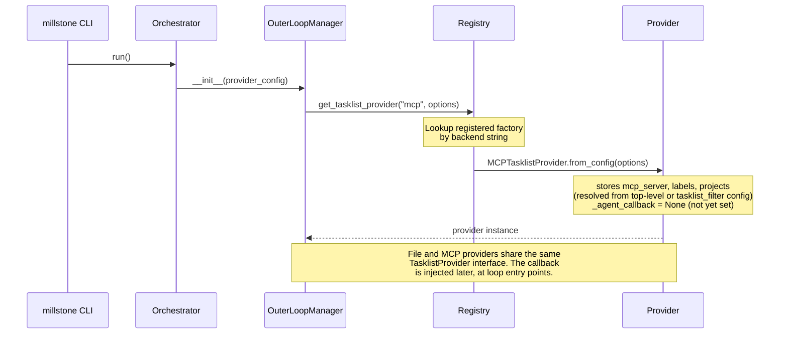
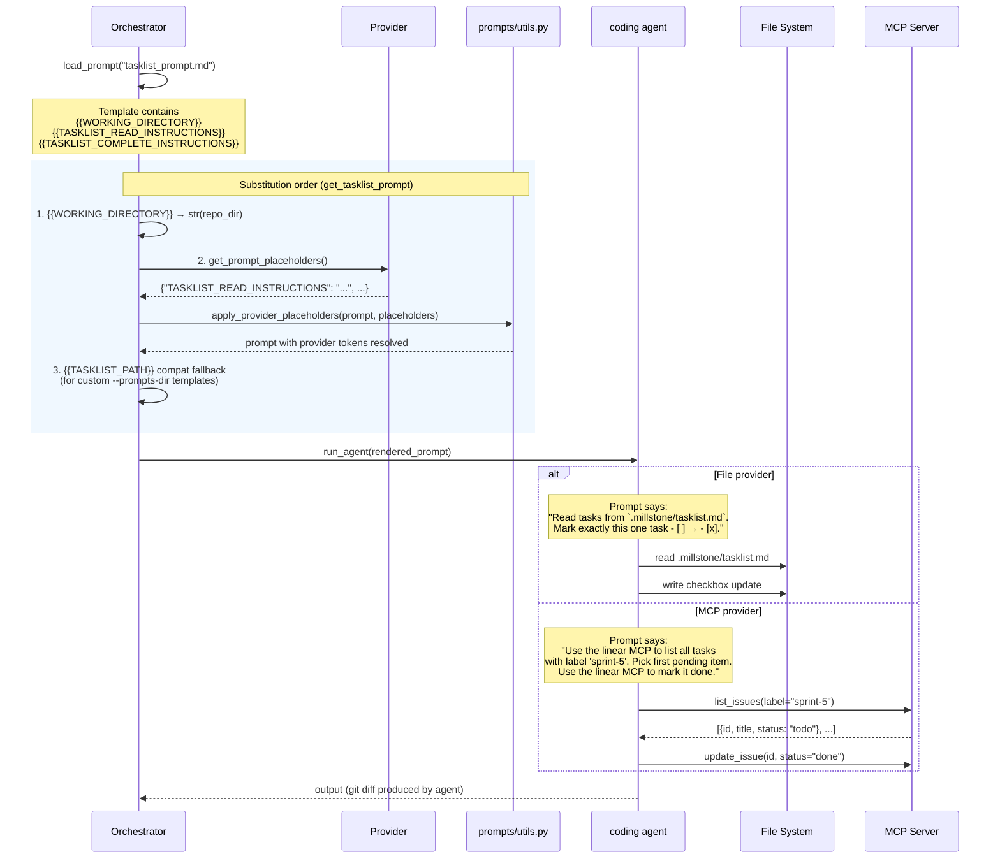
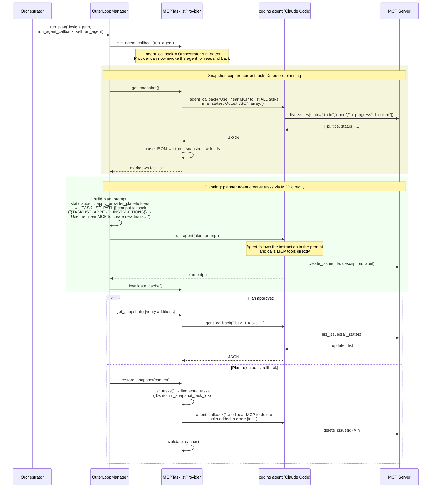

# Provider Flow: Config to Prompt to Agent to MCP

This document traces the runtime path from configuration through provider instantiation, prompt preparation, agent invocation, and — for MCP-backed providers — how the coding agent drives remote state operations via its own MCP tools.

Three sequence diagrams are provided in order of increasing complexity.

---

## 1. Initialization

How a provider backend is selected from config and instantiated before any work begins.

**Key points:**

- `config.toml` sets `tasklist_provider = "mcp"`. The backend string is looked up in a module-level registry populated by self-registering imports.
- Label and project filters are read from `options` with a two-level precedence: explicit top-level `labels`/`projects` keys win, then nested `filter.labels`/`filter.projects` (populated from `[millstone.artifacts.tasklist_filter]` config), then `label`/`project` shortcut keys. Key-presence checks (not truthiness) ensure explicit empty lists are respected and not fallen through.
- For MCP providers, `_agent_callback` is intentionally `None` at construction time. It is injected just before the provider is first used (see Diagram 3), not at startup, so the same provider instance can be reused across multiple agent sessions.
- The three provider domains (opportunity, design, tasklist) follow identical patterns.

---

## 2. Inner Loop: Task Execution

How a single task is dispatched to the coding agent, with provider-specific storage instructions embedded in the prompt.

**Key points:**

- `run_agent()` selects the CLI tool (Claude Code, Codex, Gemini, etc.) per role. The diagram shows a generic "coding agent."
- Provider placeholder substitution runs before the compat `{{TASKLIST_PATH}}` replacement. Provider values contain free-form natural language and must not shadow static tokens; the compat replacement is a string literal and is safe to apply last.
- `apply_provider_placeholders` only touches tokens whose keys appear in the provider dict. All other `{{...}}` tokens pass through untouched.
- **MCP note:** The coding agent is the MCP client. Millstone has no MCP connection or API keys. It writes the instruction; the agent invokes the MCP tool. In practice only Claude Code supports MCP tools; other CLIs will receive the instruction as plain text.
- **`{{WORKING_DIRECTORY}}`** is substituted as the first step in `get_tasklist_prompt()`, before provider placeholders. This matches the behavior of `get_review_prompt()`.

---

## 3. Outer Loop: Planning with MCP Callback Injection

The planning loop has two distinct agent invocations:

1. **Plan generation** — the planner prompt is sent directly via `run_agent`. The instruction `{{TASKLIST_APPEND_INSTRUCTIONS}}` tells the agent to create new tasks via MCP tool calls itself. Millstone does not call `append_tasks()` here.
2. **Snapshot reads and rollback** — the provider's `get_snapshot()` and `restore_snapshot()` methods need to query/mutate remote state. They do this through a stored callback (`_agent_callback`) that routes back through the same `run_agent` function.

**Key points:**

- **Callback injection is late-bound.** `_inject_agent_callbacks` is called at the start of `run_analyze`, `run_design`, `run_plan`, `review_design`, and `review_plan` — not at startup. This covers direct CLI invocation of review methods (e.g. `--review-design`) that do not pass through the outer loop.
- **Task creation is prompt-driven, not API-driven.** `run_agent(plan_prompt)` is called with an instruction that tells the agent to create tasks via MCP. The provider's `append_tasks()` method is not called in this path. Millstone's role is prompt construction and snapshot management.
- **Two distinct uses of `run_agent`.** The outer-loop prompt is sent by `OLM → run_agent`. Provider reads and rollback go through `Prov → _agent_callback`, which is the same `run_agent` function stored by reference. Both spawn a coding agent subprocess; neither is "internal."
- **Rollback is scoped.** `restore_snapshot` only deletes tasks whose IDs were not present at snapshot time. It does not restore status changes or content edits to pre-existing tasks — a known and accepted limitation documented on `MCPTasklistProvider.restore_snapshot`.
- **Effect policy gate.** Write operations dispatched by the provider (via `_agent_callback`) call `_apply_write_effect` first, allowing `C2_remote_bounded` enforcement (allowlist, idempotency key, rollback plan) before any remote state changes.

---

## Summary: What Millstone Controls vs. What the Agent Controls

| Concern | Millstone | Coding Agent |
|---|---|---|
| Provider backend selection | ✓ config + registry | — |
| Prompt template rendering | ✓ placeholder substitution | — |
| MCP server configuration | — | ✓ agent-local (e.g. `mcp_servers.json`) |
| MCP tool invocations | — | ✓ `linear:create_issue(...)` etc. |
| Policy gate (write effects) | ✓ `EffectIntent` enforcement | — |
| JSON parsing of agent output | ✓ `list_tasks`, `get_task` | — |
| Rollback (delete added tasks) | ✓ orchestrates via callback | ✓ executes MCP delete call |
